
 <h1> Lab 2 Report</h1> 

| **Course Name**  | **Windows Operating System \|\|\|**|
|:-------------| :-----------------------------:|
|Student Name  | Ryan Spaulding-Best            |
|Student ID    | 040965856                      |

# lab03-00
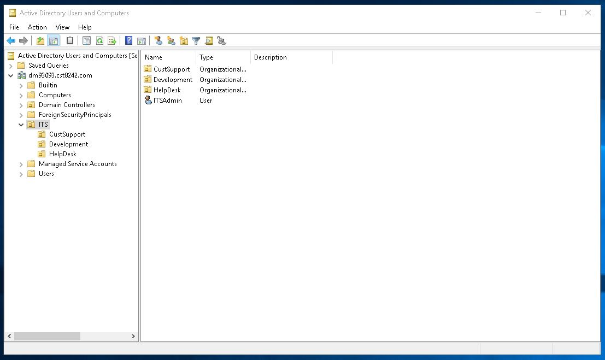
## #1 Assigned Software Deployment
## #2 You would create GPOs to in the ITS OU
# lab03-03
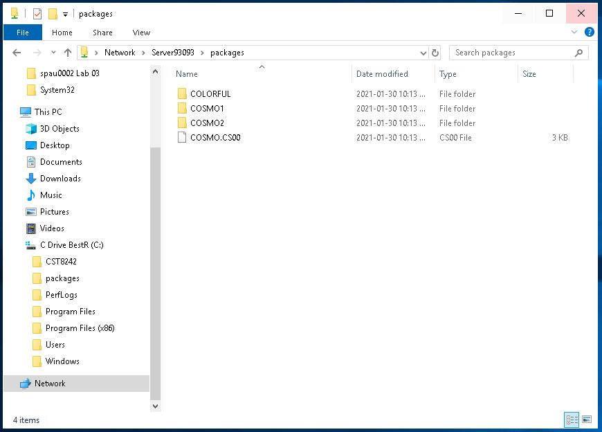
# lab03-04
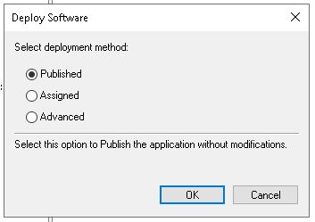
# lab03-05
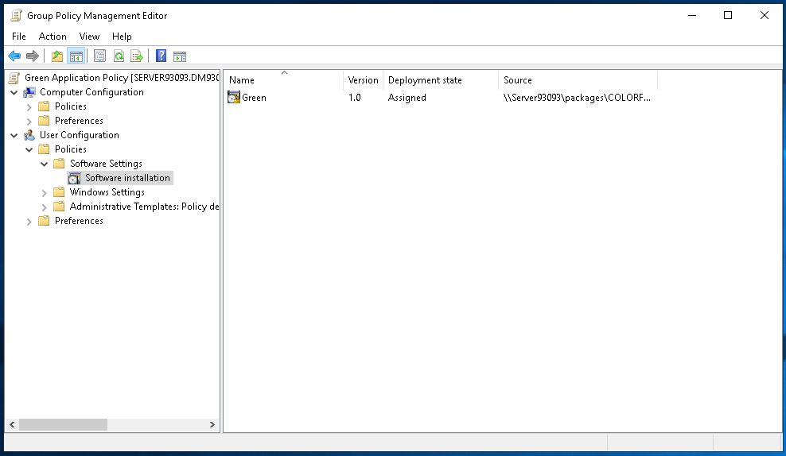
## #6 Green is now in programs
## #7 Green was installed
# lab03-08
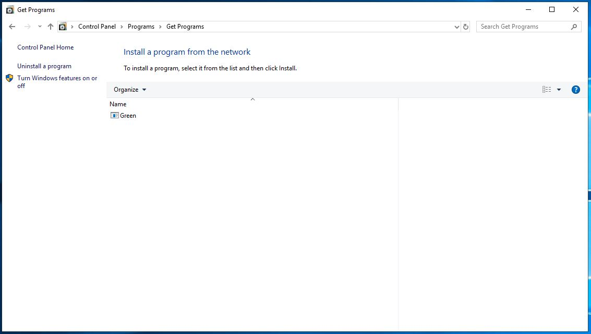
## #9 Green opens. This is because deploy was assigned
# lab03-10
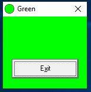
## #11 Blue, Green and Red are on the programs menu
## #12 Blue, Green and Red
## #13 Red is already installed
## #14 Blue is already installed
# lab03-15
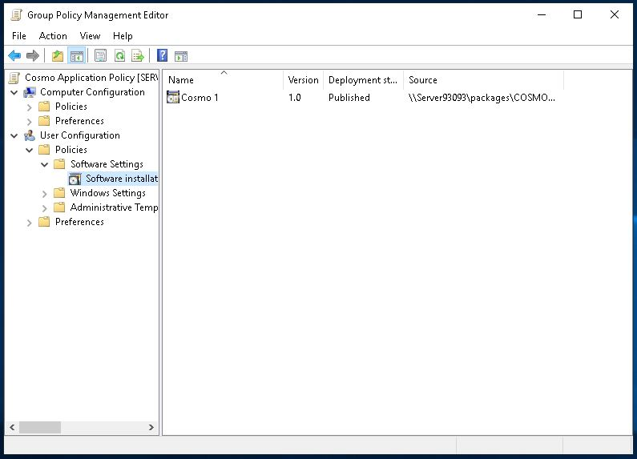
## #16 Cosmo 1 does not appear
## #17 Cosmo 1 and Green
# lab03-18

## #19 No, I can tell because it doesn’t have a default application to open with
## #20 Cosmo.CS00 opens
# lab03-21
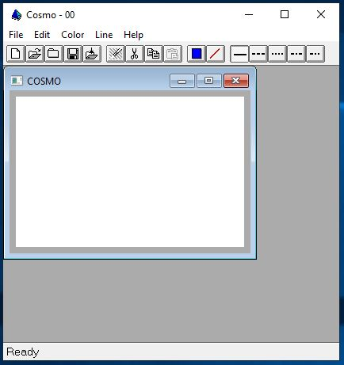
## #22 Cosmo1 is available
## #23 Cosmo1 does not appear because of the group policy
# lab03-24
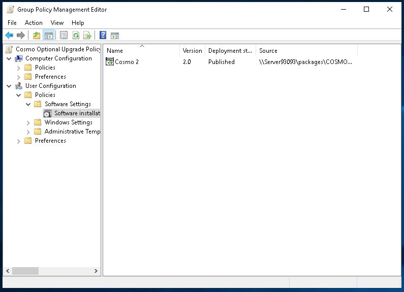
## #25 CSUser can still run Cosmo1
# lab03-26
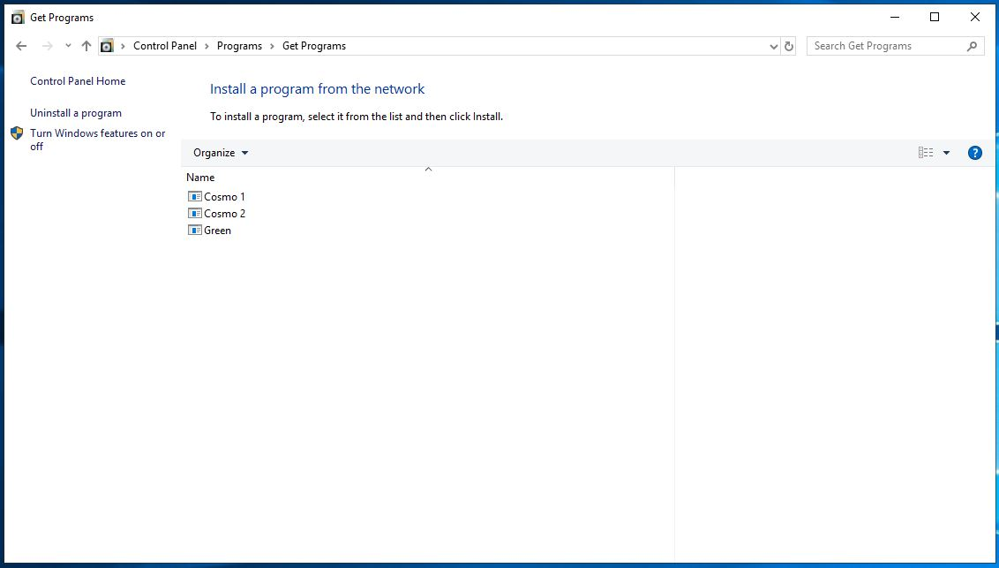
## #27 Cosmo 1 is not available on the programs menu. This is because Cosmo2 uninstalled Cosmo1 when upgrading
## #28 You can run Cosmo2 from the programs menu
# lab03-29
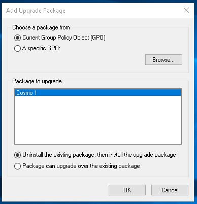
# lab03-30
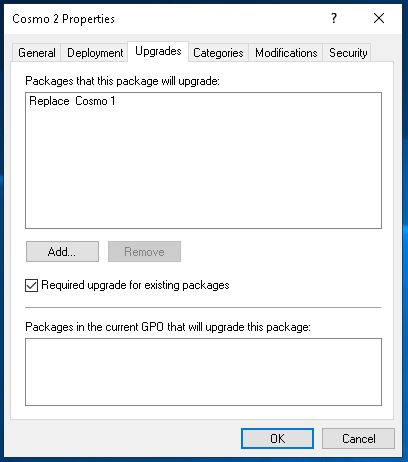
# lab03-31
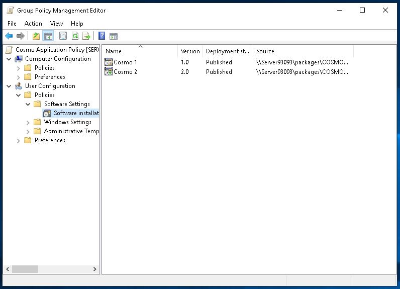
# lab03-32
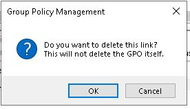
## #33 Cosmo1 is not available on the programs menu. This is because Cosmo 2 uninstalled Cosmo 1 when upgrading
## #34 Cosmo2 opens
# lab03-35
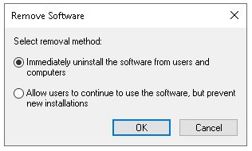
## #36 Cosmo2 is no longer there
## #37 Green is no longer there
## #38 Cosmo2 is no longer available because Cosmo2 was removed on all users
## #39 Green is not available. It may continue to be used by Users who had it previously installed, but it can not be installed
## #40 Cosmo2 is no longer available because Cosmo2 was removed on all users
## #41 Green is available
