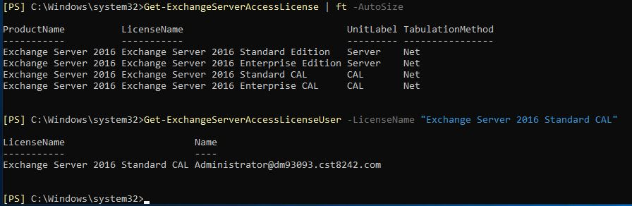

# Lab 5 Report

| **Course Name**  | **Windows Operating System \|\|\|**|
|:-------------| :-----------------------------:|
|Student Name  | Ryan Spaulding-Best            |
|Student ID    | 040965856                      |

## Lab05-01

## Lab05-02

## Lab05-03

## Lab05-04

## Lab05-05

## Lab05-06

## Lab05-07

## Lab05-08

## Lab05-09

## Lab05-10

## Lab05-11

## #12 more options under mailbox usage allows you to set storage quotas per user

## #15 in your ecp Window

## Lab05-16

## Lab05-17

## Lab05-18

## Lab05-19

## #20 >mkdir DDrive\Databases\DB1

## Lab05-21

## Lab05-22

## Lab05-23

## #24 Get-Mailbox -Database "DB1" | New-MoveRequest -BatchName "Logs\DB1 to NEW\DB1" -TargetDatabase "Logs\NEW\DB1"
